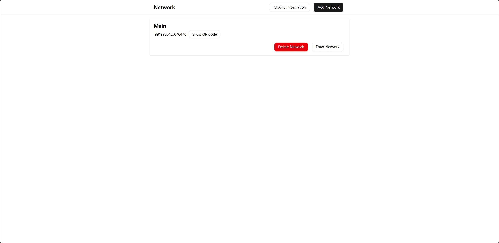

<p align="center">
  
</p>
<h2 align="center">ZTVRUI</h2>
</p>
<h3 align="center">Zerotier One Controller WebUI</h3>
<br/>

**Now Support Language：[简体中文](README_CN.md) (zh-CN), [English](README.md) (en)**

## Preview

#### Network Info Page


</br>

<details>
<summary>Login Page</summary>


</summary>
</details>

<details>
<summary>Networks Page</summary>



</summary>
</details>

## Installation

#### First

Install Zerotier One and start the service. You can find the installation instructions on the [official website](https://www.zerotier.com/download/).

And then download the example [configuration file](example.config.json) from the repository and modify it according to your needs.

The default username is `admin` and the default password is `password`. You can change the password by modifying the configuration file and using bcrypt to hash the new password. You can encrypt the password using [bcrypt.online](https://bcrypt.online/).

Or you can change the password by webui after the first login.

You can find the method to obtain the zerotier authtoken from the [zerotier docs](https://docs.zerotier.com/api/tokens#zerotierone-service-token).
For Linux users, you can use the following command to get the authtoken.

```bash
cat /var/lib/zerotier-one/authtoken.secret
```

**Example Configuration File**

```bash
{
  "info": {
    "username": "admin",
    "password": "$2b$08$L0G551nXjXw78mUANEC31uUXyx2SsEsmYkq7xPsa2umnQ/YSBeYV6"
  },
  "listen": "0.0.0.0:7000",
  "zerotier": {
    "auth_token": "your_zerotier_token",
    "address": "http://127.0.0.1:9993"
  }
}

```

</br>

#### Second

Download the latest release from the [release page](https://github.com/TnZzZHlp/ztvrui/releases/latest) and extract it.

Run ztvrui with the configuration file.

```bash
./ztvrui -c config.json
```
