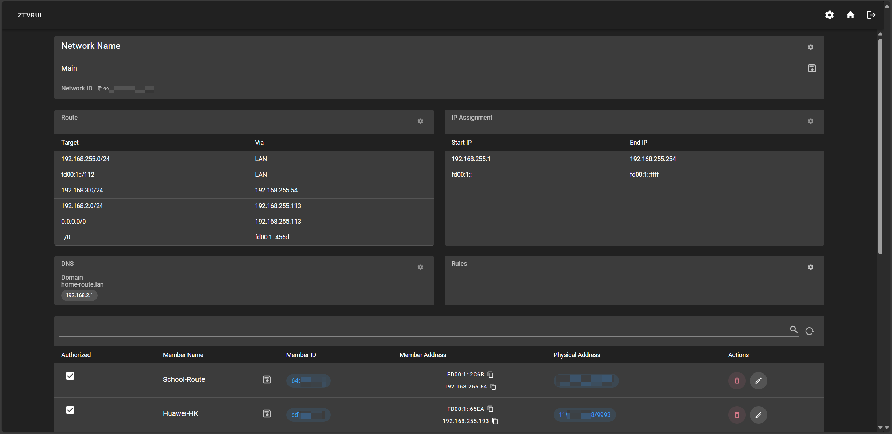

<p align="center">
<h2 align="center">ZTVRUI</h2> 
</p>
<h3 align="center">Zerotier One 控制器 WebUI</h3>
<br/>

**当前支持语言：[简体中文](README_CN.md) (zh-CN), [English](README.md) (en)**

## 预览

#### 网络信息页面


</br>

<details>
<summary>登录页面</summary>


</summary>
</details>

<details>
<summary>网络页面</summary>


</summary>
</details>

<details>
<summary>修改网络信息页面</summary>


</summary>
</details>

<details>
<summary>修改路由页面</summary>


</summary>
</details>

<details>
<summary>修改IP分配池页面</summary>


</summary>
</details>

<details>
<summary>修改DNS页面</summary>


</summary>
</details>

<details>
<summary>修改成员页面</summary>


</summary>
</details>

## 安装

#### 第一步

从仓库下载示例[配置文件](example.config.json)，并根据需求进行修改。

默认用户名为`admin`，默认密码为`password`。可以通过修改配置文件并使用 bcrypt 对新密码进行哈希来更改密码。 使用[bcrypt.online](https://bcrypt.online/)来加密密码。

或者，也可以在首次登录后通过 web 界面更改密码。

可以从[zerotier 文档](https://docs.zerotier.com/api/tokens#zerotierone-service-token)中找到获取 zerotier 认证令牌的方法。
对于 Linux 用户，可以使用以下命令来获取认证令牌。

```bash
cat /var/lib/zerotier-one/authtoken.secret
```

**示例配置文件**

```bash
{
  "info": {
    "username": "admin",
    "password": "$2b$08$L0G551nXjXw78mUANEC31uUXyx2SsEsmYkq7xPsa2umnQ/YSBeYV6"
  },
  "listen": "0.0.0.0:7000",
  "zerotier": {
    "auth_token": "your_zerotier_token",
    "address": "http://127.0.0.1:9993"
  }
}

```

</br>

#### 第二步

从[release](https://github.com/TnZzZHlp/ztvrui/releases/latest)下载最新版本并解压。

然后使用配置文件运行 ztvrui。

```bash
./ztvrui -c config.json
```
